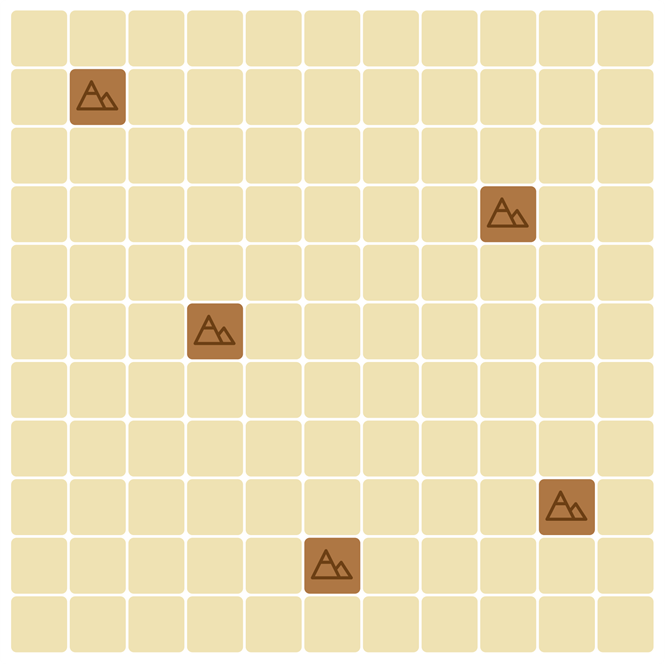

# The mapmaker
In the neighbour of Neverfindland there is a big country, the Potato Empire, many parts of which are still unknown and uninhabited. Its ruler, Empress French Frie, ordered the mapping and settlement of these areas. As a first step, she commissioned you as imperial mapmaker to discover the landscape. The Empress sets missions to determine what landscapes she wants to see in her empire. Help her to fulfil her wishes as much as possible, so that your reputation can grow accordingly!

**link: https://leedskiy.github.io/The-Mapmaker/**

## Description of the game

### Brief overview
In this single-player game, you have to place map elements of different shapes and terrain types on an 11x11 square grid map. Each element is assigned a time value (1 or 2) and the game consists of 28 time units. At the end (or during) of the game, a number of checks (missions) are performed against the current state of the grid, and the final score is calculated.

### Initial state of the map
The map is an 11x11 square grid, initially filled with empty cells. The map contains mountain fields in 5 fixed cells. Our mountains are located in the following cells of the map:
(row, column) => (2,2), (4,9), (6,4), (9,10), (10,6)

### Placing map elements
The types of terrain of map elements that can be placed are: forest, village, farm and water. Some of them look like this:

The possible elements are shuffled randomly and then you need to place them on the map one by one in sequence. Each map element can be rotated and mirrored, and the map element cannot cover an already reserved field (a mountain is a reserved field), or have any part of it hanging off the map.

### End of the game
The game lasts up to 28 time units. Each map element is assigned a time unit, which determines how long it takes to explore it. You can draw new map elements until you reach 28 time units. When the total time value reaches or exceeds 28 time units, the game ends. For example, if we have 1 time unit left and we get a map element with two time units, we can still place the map element and then the game ends.

### Calculating the score
At the beginning of each game, 4 random mission cards (A,B,C,D) are selected to score points. An example of a mission card is this:
'You get three points for each of your water fields adjacent to your mountain fields.'

If you surround the mountains on 4 sides, you get 1 point per surrounded mountain.

At the end of the game, the points you got for each mission are counted, and the sum of these will be the final score.

### Seasons
The 28 time units represent one year. It is divided into 4 seasons, each season lasting up to 7 units of time. If the total time value reaches or exceeds a multiple of 7 while placing the map elements, the season ends.

At the end of each season, you can score for 2 missions. At the end of spring, you can score points for mission A-B, at the end of summer for mission B-C, at the end of autumn for mission C-D and at the end of winter for mission D-A.

At the end of the game, the points you have earned over the four seasons will be added together to give you your final score.

### Missions
Here you will find the missions to be evaluated in the game and the corresponding pictures.

* Edge of the forest: you get one point for each forest field adjacent to the edge of your map.
* Sleepy valley: for every row with three forest fields, you get four points.
* Watering potatoes: You get two points for each water field adjacent to your farm fields.
* Borderlands: for each full row or column, you get six points.
* Tree line: You get two points for each of the fields in the longest vertically uninterrupted continuous forest. If there are two or more tree lines with the same longest length, only one counts.
* Wealthy town: You get three points for each of your village fields adjacent to at least three different terrain types.
* Watering canal: For each column of your map that has the same number of farm and water fields, you will receive four points. You must have at least one field of both terrain types in your column to score points.
* Magicians' valley: You get three points for your water fields adjacent to your mountain fields.
* Empty site: you get two points for empty fields adjacent to your village fields.
* Row of houses: for each field in the longest village fields that are horizontally uninterrupted and contiguous you will get two points.
* Odd numbered silos: for each of your odd numbered full columns you get 10 points.
* Rich countryside: for each row with at least five different terrain types, you will receive four points.

### The page

The following things are displayed on the page:
* 11x11 grid as the map, showing the mountains and the dropped shapes
* The names and descriptions of randomly selected missions
* Time units remaining in the game
* Which season we are in and the game indicates which missions belong to which
* The number of points we have collected during the seasons
* Our total points and how many points we have earned for each mission.
* The item to place and the associated time period
* Rotate and mirror buttons
